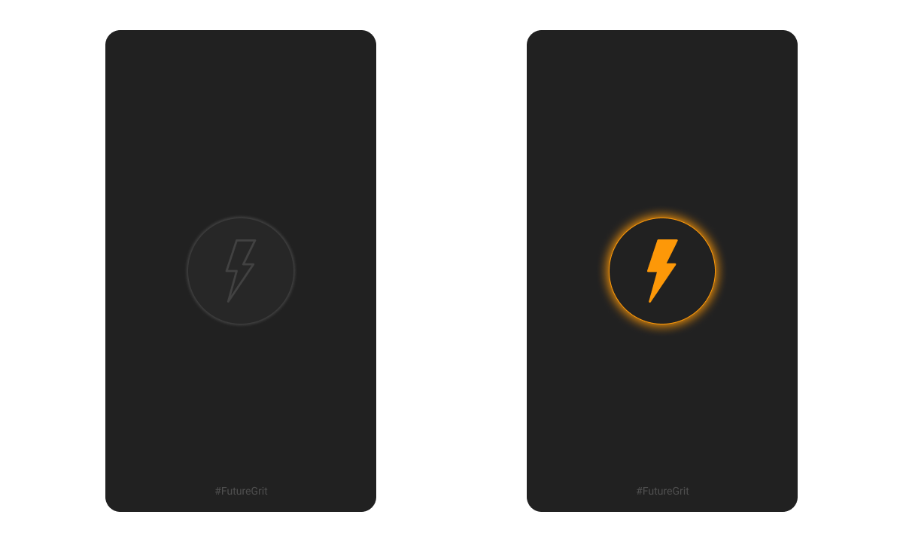

***NOTE: This application is still under development and the actual functionality yet to be implemented. Stay Tuned.*** 
# Flashlight 
***Let's End Darkness Together***

This application will turn your smartphone into a super flashlight. You'll find the basic torch functionality with this app. The entire UI consists of a single button. Pressing it will turn the light on and off.

## Getting Started

This project is a starting point for a Flutter application.

A few resources to get you started if this is your first Flutter project:

- [Lab: Write your first Flutter app](https://flutter.dev/docs/get-started/codelab)
- [Cookbook: Useful Flutter samples](https://flutter.dev/docs/cookbook)

For help getting started with Flutter, view our
[online documentation](https://flutter.dev/docs), which offers tutorials,
samples, guidance on mobile development, and a full API reference.
