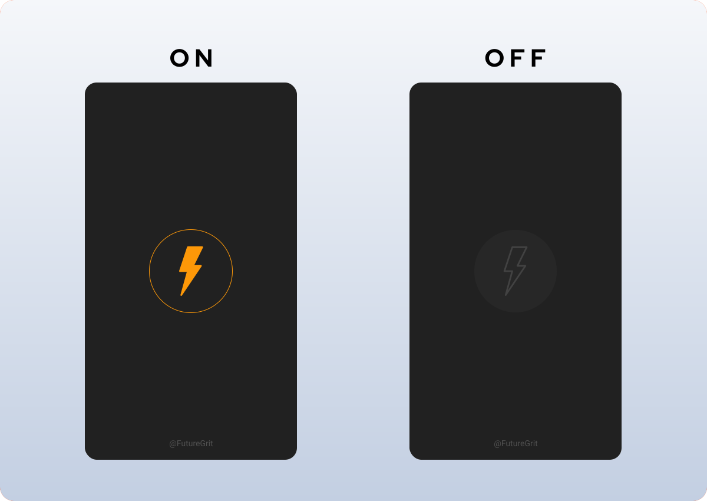

# Flashlight 
***Let's End Darkness Together***

This application will turn your smartphone into a super flashlight. You'll find the basic torch functionality with this app. The entire UI consists of a single button. Pressing it will turn the light on and off.

   &nbsp; 
  

 

## Roadmap
* iOS Implementation
* Testing
* Deployment
